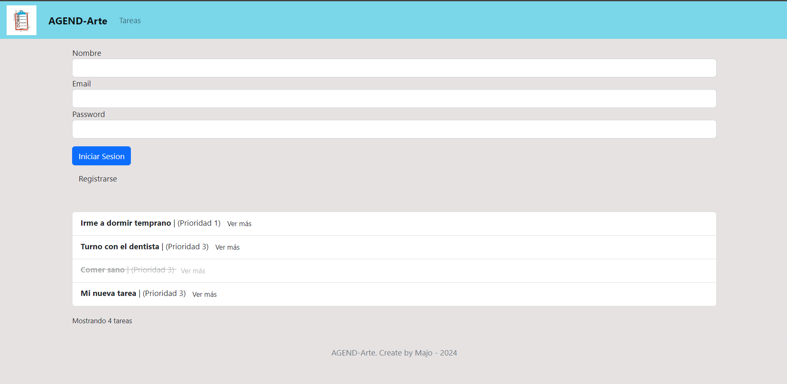
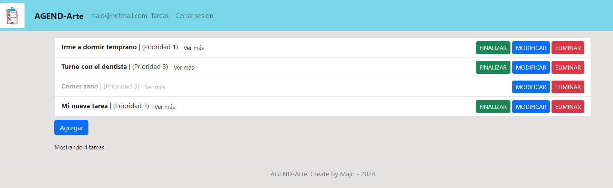

## Importar la DB
Importar el archivo `db_tareas.sql` dentro de PHPMyAdmin para tener la base de datos completa.

# Agend-Arte
Es una lista de tareas utilizando MVC, url semantica, renderización del lado del servidor con PHP y MySQL. Para usar todas las funcionalidades de la misma se debe hacer un login de usuario, y mediante el email y contraseña se acceden a las funciones CRUD.

email: majo@hotmail.com
password: 123456

