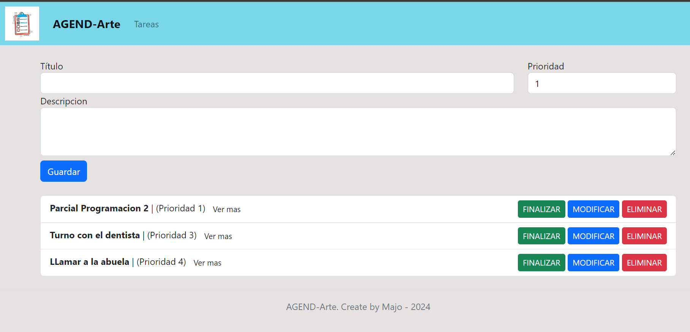

## Importar la DB
Importar el archivo `db_tareas.sql` dentro de PHPMyAdmin para tener la base de datos completa.

# Agend-Arte
Es una lista de tareas utilizando MVC, url semantica, renderización del lado del servidor con PHP y MySQL.

