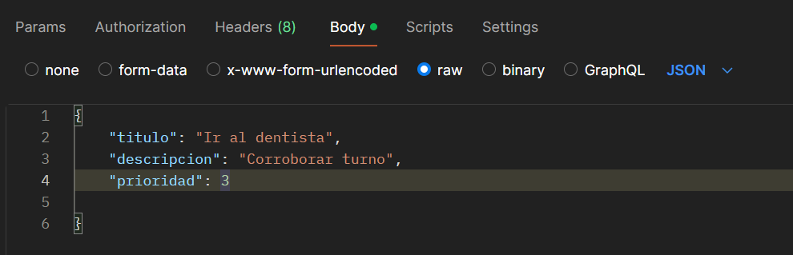

# TODOList API
Lista de tareas utilizando renderización del lado del servidor con PHP y MySQL.

## Importar la DB
Importar el archivo `db_tareas.sql` dentro de PHPMyAdmin para tener la base de datos completa.

## Direcciones para utilizar la api  
http://localhost/... (ubicacion de la api en local)

http://localhost/.../api/tareas (todas las tareas)

http://localhost/.../api/tareas/1 (el numero es el id que quiero buscar, en este caso 1,  una tarea en especifico)

http://localhost/.../api/tareas?orderBy=prioridad (odena por prioridad)

http://localhost/.../api/tareas?orderBy=titulo (ordena por titulo)

http://localhost/.../api/tareas?orderBy=titulo

http://localhost/.../api/tareas?finalizada=1 (filtrar finalizada)

Pedir todas las tareas (GET /api/tareas)
Crear una nueva tarea (POST /api/tareas)
Actualizar una tarea (PUT /api/tareas/{id})
Eliminar una tarea (DELETE /api/tareas/{id})

## Despliegue  
Para desplegar y ver el funcionamiento de la misma se puede hacer mediante la descarga de POSTMAN: https://www.postman.com/downloads/ (debe descargarse al equipo si va a utilizarse en local, es decir desde la propia maquina)
o puede descargarse la extension en visual studio llamada Thunder Client y usarse desde ahi mismo.  
Para ingresar informacion para agregar o modificar con POST o PUT puede hacerse en body- raw y con el formato JSON, y pasando la informaion como un objeto:    

Ej:  

{
    "titulo": "Ir al dentista",
    "descripcion": "Corroborar turno",
    "prioridad": 3
        
}