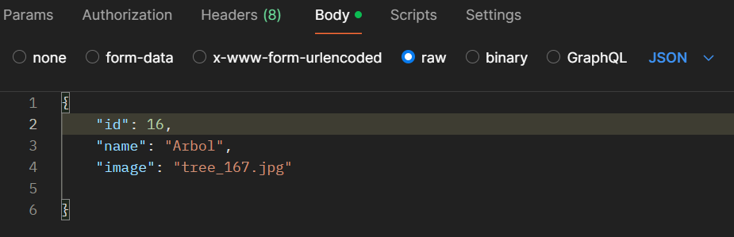

# API REST photo album  
Con esta api rest se pueden manejar la informacion para ver y modificar una base de datos que aloja un album de imagenes.  

## Direcciones  
http://localhost/...  

http://localhost/.../api/photos (todas las photos)  

http://localhost/.../api/photos/1   (id) (una tarea en especifico)  

http://localhost/.../api/photos?orderBy=nombre (odena por nombre asc)  

http://localhost/.../api/photos?orderBy=id (ordena por id asc)  

http://localhost/.../api/photos?name=arbol  (selecciona los que tienen un nombre dado)  

## Mapa de ruteo  
Pedir todas las photos (GET /api/photos)  
Crear una nueva tarea (POST /api/photos)  
Actualizar una tarea (PUT /api/photos/{id})  
Eliminar una tarea (DELETE /api/photos/{id})  

## Despliegue  
Para desplegar y ver el funcionamiento de la misma se puede hacer mediante la descarga de POSTMAN: https://www.postman.com/downloads/ (debe descargarse al equipo si va a utilizarse en local, es decir desde la propia maquina),  
o puede descargarse la extension en visual studio llamada Thunder Client y usarse desde ahi mismo.  
Para ingresar informacion para agregar o modificar con POST o PUT puede hacerse en body- raw y con el formato JSON, y pasando la informacion como un objeto:  
  

Ej:  

{  
    "titulo": "Ir al dentista",  
    "descripcion": "Corroborar turno",  
    "prioridad": 3
        
}  